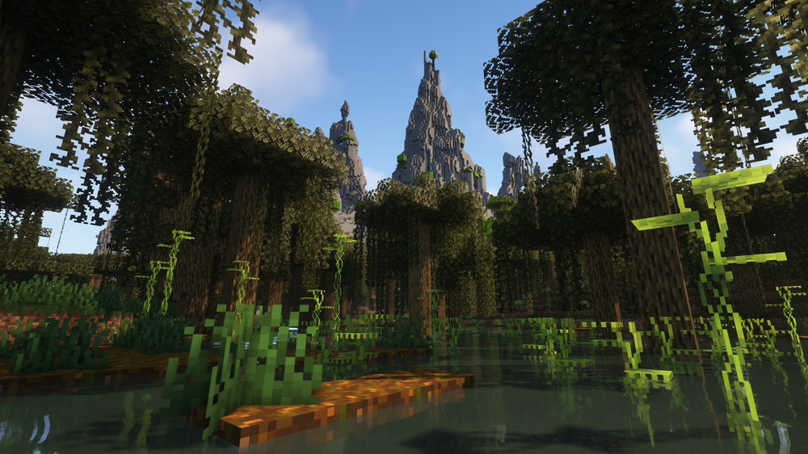
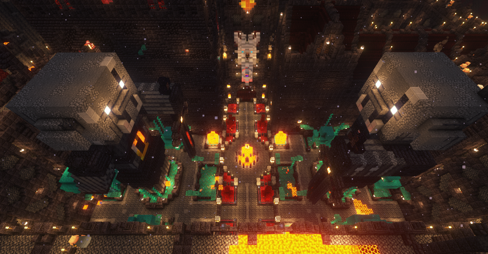
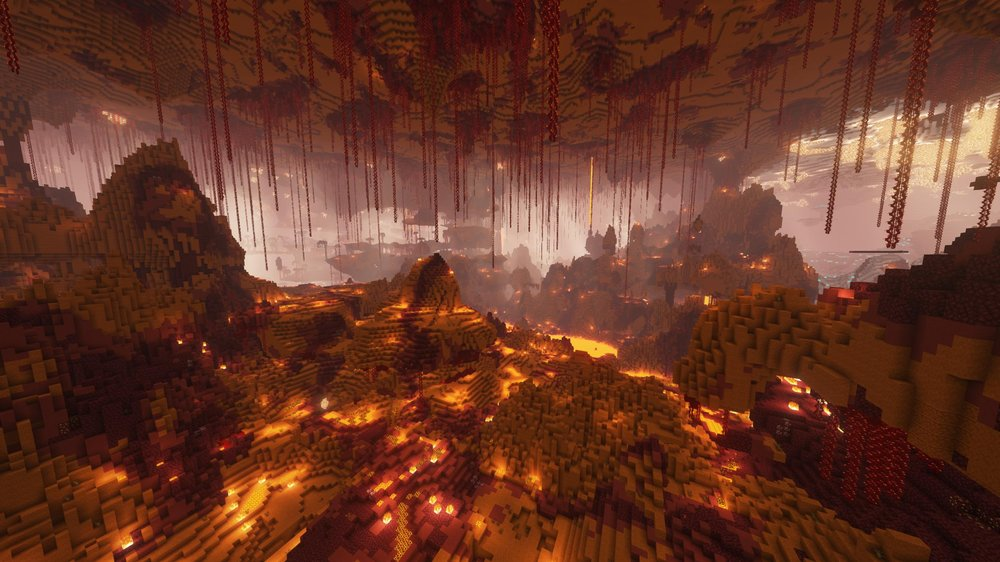
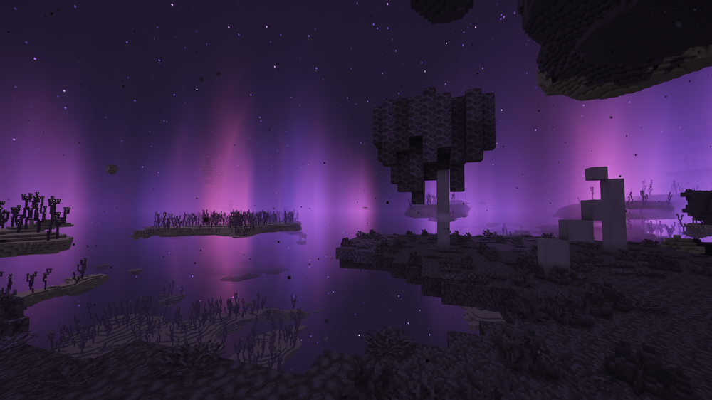
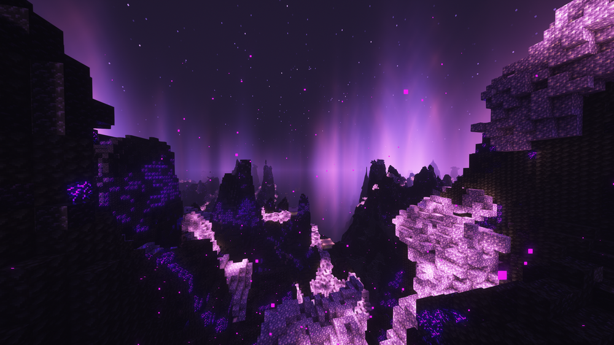
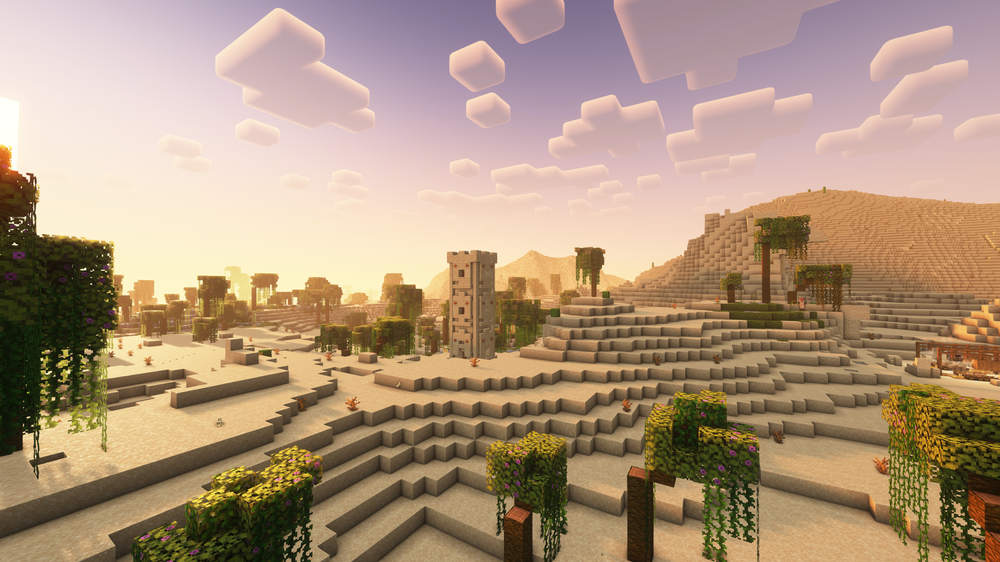
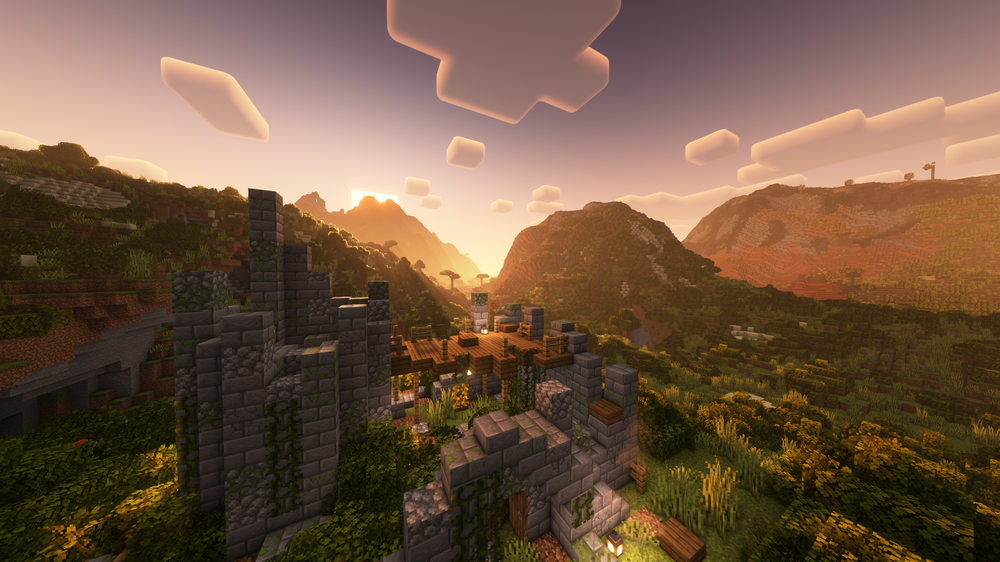

# Data Packs - World Generation

## Terralith

Designed to fit the existing vanilla experience, Terralith transforms the landscape of Minecraft to be on par with painted maps. With this vastly diverse topography, we can find volcanoes — impressive mountain ranges with towering peaks cover thousands of blocks in incredible terrain shapes — valleys cut through otherwise uninspiring scenery, and our new structures make each biome feel even more alive.

## Incendium

Incendium is an action-packed Minecraft datapack and mod. Our 8 totally unique ecosystems are the lifeblood of this Nether overhaul, complemented by breathtaking structures, custom bosses, and new items. We’ve even puzzled together some secrets within its structures.

## Nullscape

Nullscape began as a community request to fill the void with Starmute’s terrain generation. Since then, it has grown to be an experiment in how materials science can apply to worldgen, and one of our most beloved mods.

## Structory

Structory is a structure mod with a soul. We decided to not only add ambience to the world, but ingrain some pieces of lore to uncover, all while sticking to a style of storytelling which is compatible with most or all server and modpack themes. Stories are told primarily through the structures themselves, or their inhabiting villagers. Anything ambitious is kept out of the main “Structory” mod and left to its add-ons.
