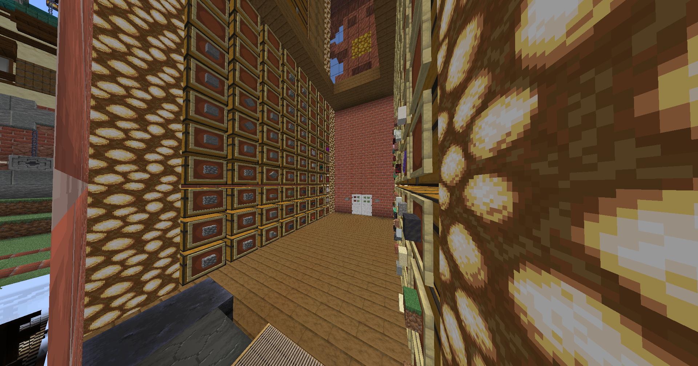
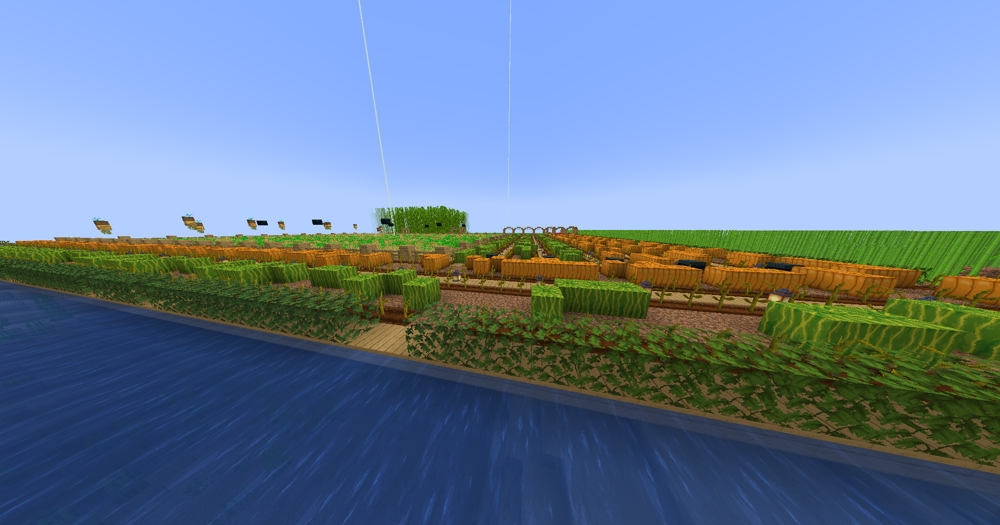

# Eye-Sores & More

### Introduction

Welcome to Augusta Towny, where we strive to maintain a beautiful and harmonious environment for all players. The Eye-Sore Rule and Guidelines have been established to ensure that our town's landscapes remain visually appealing and enjoyable for everyone.

### Eye-Sore Rule

The Eye-Sore Rule is in place to prevent the creation of structures or elements within the server that may be considered visually disruptive, unappealing, or inappropriate. This rule helps maintain a high standard of aesthetics across Augusta Towny.

## How To Avoid Building An Eye-sore

1. **Make It Match:** Build things that aren't hard to look at.  We want everything to go together and make sense.
   1. Consider gravity into your builds.&#x20;
      1. How is that platform up there?&#x20;
         1. Is your island floating? Make it have clouds carrying it for example.
      2. Want to build a sky mob farm?&#x20;
         1. Turn it into a hot air balloon!&#x20;
   2. Block Palette
      1. Some blocks just dont go well together.&#x20;
         1. Carefully pick and plan the blocks that you want to use!
            1. [Block Palettes](https://www.blockpalettes.com/) is an excellent resource to figure out what to build with.
2. **Multi-purpose:** A build can be both good-looking and have money/quest purpose. For example, this storage room is within a large clock tower that adds to the towns aesthetic appeal
   1.

       
<figure><figcaption>
Good Build|Clock Tower
</figcaption></figure> <figure><figcaption>
Good Build|Clock Tower Interior
</figcaption></figure>

3. **Landscaping:** Making sure your builds are well incorporated into your landscape is crucial to avoiding eye-sores. Thoughtful use of terrain, plants, and outdoor features contributes to a well-rounded build.
   1. This also includes making sure you don't have mysterious floating platforms with no supports, or building on water with no anchors! 🛥️
      1.

          
<figure><figcaption>
Example of an eye-sore! This build is floating over water.
</figcaption></figure> <figure><figcaption>
Example of an eye-sore!  This build is floating on water.
</figcaption></figure>

4. Note on Farms:
   1. [Please note - Large farms/mob farms are not excused from the eye-sore rule. It is possible and expected that you disguise or multi-purpose farms.](#user-content-fn-1)[^1]
   2. We encourage large scale mob farms/crop farms, however it is expected that they abide to the eye-sore rule. Think of them as an extension of your town.  Blend functionality with aesthetics.&#x20;
      1. You can do this by
         1. Staircase to an underground farm instead of a hole.
            1. Instead of a simple hole, create a well-designed staircase leading to your underground farm.&#x20;
         2. Neat Walls
            1. Ensure the walls of your underground farms are well-organized. Avoid unfinished stone walls or chaotic/cluttered appearances.
         3. Thoughtful Lighting
            1. Incorporate lighting into the build&#x20;
               1. Don't do rows of floating lights, for example. Attach them to the ceiling instead!

## Eyesore Removal

Staff are subject to remove eye-sore builds or farms. Augusta Towny has dedicated representatives and builders that are willing to assist in improving any eyesores to avoid removal.

Staff will open a ticket through our discord regarding your eye-sore and inform you of the following.

&#x20;    _Coordinate Location:_

&#x20;    _Screenshot:_

&#x20;    _Description of Issue:_&#x20;

[Players will receive 3 full days to resolve or improve the concern.](#user-content-fn-1)[^1]

## Resolving Or Improving looks like..

Resolving = Build is now complete and up to standard

Improved = Visual Improvements are obvious compared to initial screenshot(s) in ticket.

## Reporting Eye-Sores

If you come across a structure that you believe violates the Eye-Sore Rule or Guidelines, please report it to the town administrators or use the designated ticketing system. Include the following specific details about the concern to assist in the review process.

&#x20;    _Coordinate Location:_

&#x20;    _Screenshot:_

&#x20;    _Description of Issue:_&#x20;

###

[^1]: 
