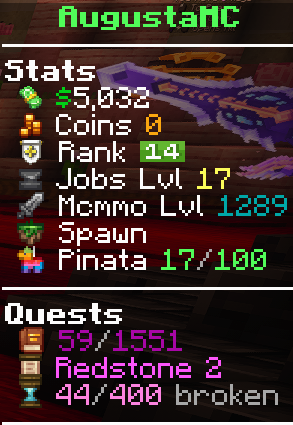

# Cosmetic Menu

<figure><figcaption></figcaption></figure>

***

## Player Cosmetics

On AugustaMC, we have player cosmetics! 👕

These cosmetics, as seen above, can be earned through crates or the store!

* /cosmetics&#x20;
  * This opens the above menu!
    * Hover over an item..

<figure><figcaption></figcaption></figure>

* Click To Equip/ Unequip!

<figure><figcaption></figcaption></figure>

<strong>Now enjoy your new cosmetic!</strong>

