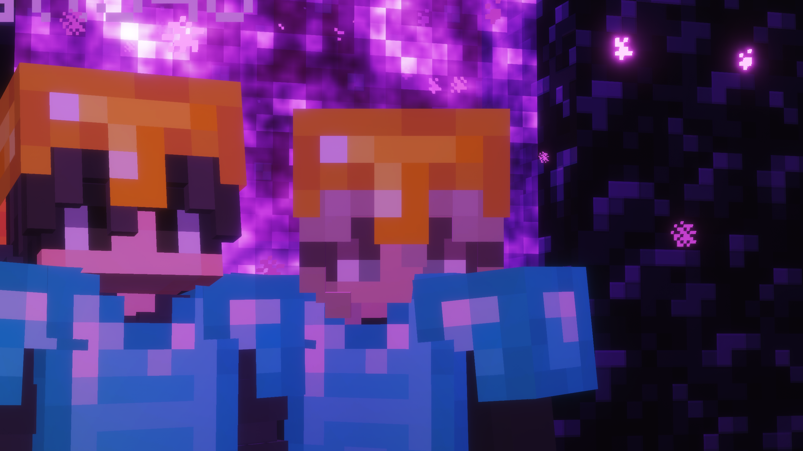

# 🎫 Community Council

## 🚧 UNDER CONSTRUCTION 🚧 - SUBJECT TO CHANGE

<figure><figcaption></figcaption></figure>

### Overview

The Community Council is a player-focused volunteer role dedicated to improving community engagement across AugustaMC. **Council members work alongside staff and players to organize events, encourage participation, support creativity, and strengthen the overall social atmosphere of the server.**

The purpose of the Community Council is not moderation or punishment. Instead, this role exists to help create enjoyable experiences for players through collaboration, communication, and community-driven activities.

**Community Council is heavily centered around survival-based community projects and player-built events.** Members are encouraged to organize activities naturally within normal gameplay rather than relying on administrative tools or staff intervention. Most projects, event arenas, decorations, and activities should be created through standard survival play whenever possible.

Community Council members are trusted representatives of the playerbase who help turn player ideas into real events, projects, and traditions within AugustaMC.

