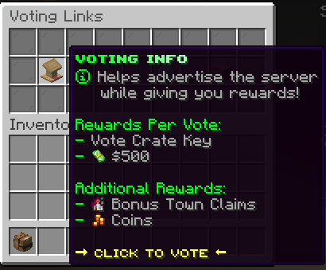

# 📓 Voting System

🚧Under Construction🚧

<figure><figcaption>
<a href="https://store.augustamc.com/category/vote">https://store.augustamc.com/category/vote</a>
</figcaption></figure>

The voting system in AugustaMC is a core part of how the server grows, stays active, and attracts new players.

Players vote for the server on Minecraft server listing websites. Each vote acts like a “boost” that tells those sites the server is active and worth showing to more people. When Augusta gets more votes, it rises higher in the rankings on those lists.

<figure><figcaption></figcaption></figure>

### How To Vote

The primary way is by using the **/vote** command in-game, which brings up all available voting links. These links take players directly to server listing sites where they can submit their vote for Augusta.

Alternatively, players can also access the same voting links through the **server’s store website**, which provides quick navigation to all voting pages outside of Minecraft.

